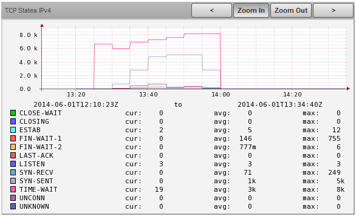
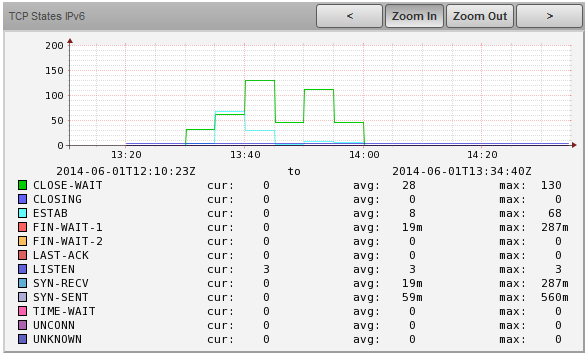

# TCP Statistics

@lb

## Community

This ZenPack is developed and supported by the Zenoss User Community.
[Contact Zenoss](https://tryit.zenoss.com/zenpack-contact/){.external-link} to
request more information regarding this or any other ZenPacks. [Click here](https://zenoss.com/product/zenpacks?f%5B0%5D=im_field_zenpack_category:1021){.external-link} to
view all available Zenoss Community ZenPacks.

### Authors:

Jan Garaj

### Maintainers:

Jan Garaj

### Organization:

Jan_Garaj

### License:

GNU General Public License, Version 2, or later

### Name:

ZenPacks.JanGaraj.TcpStat

### More Information:

[GitHub page/HomePage](https://github.com/monitoringartist/ZenPacks.JanGaraj.TcpStat){.external-link}

### Git Sources (For Cloning):

[Link](https://github.com/monitoringartist/ZenPacks.JanGaraj.TcpStat){.external-link}

## TCP Statistics ZenPack

This SSH-based ZenPack provides TCP state statistics for IPv4 and IPv6.

## Support

This ZenPack is developed by the Zenoss user community and supported via
our online forums. Zenoss, Inc. does not provide direct support for this
ZenPack.

## Releases

Version 1.0.0- [Download](https://storage.googleapis.com/zenpacks/ZenPacks.JanGaraj.TcpStat/1.0.0/ZenPacks.JanGaraj.TcpStat-1.0.0.egg){.external-link}:   **Summary of changes:** Init release:   Released on 2014/06/07:   Compatible with Zenoss Core 4.2.x

## Background

<table>
<colgroup>
<col />
<col />
</colgroup>
<tbody>
<tr markdown="1">
<td>

Graph TCP States IPv4

</td>
<td>

Graph TCP States IPv6

</td>
</tr>
</tbody>
</table>

## Attachments:

-   [TCP_States_IPv4.png](img/zenpack-tcp_states_ipv4.png)
-   [TCP_States_IPv6.png](img/zenpack-tcp_states_ipv6.png)
-   [zenpack-general.png](img/zenpack-zenpack-general.png)
-   [TCP_States_IPv4.png](img/zenpack-tcp_states_ipv4.png)
-   [TCP_States_IPv6.png](img/zenpack-tcp_states_ipv6.png)
-   [zenpack-general.png](img/zenpack-zenpack-general.png)
-   [TCP_States_IPv6.png](img/zenpack-tcp_states_ipv6.png)
-   [TCP_States_IPv4.png](img/zenpack-tcp_states_ipv4.png)
-   [zenpack-general.png](img/zenpack-zenpack-general.png)

